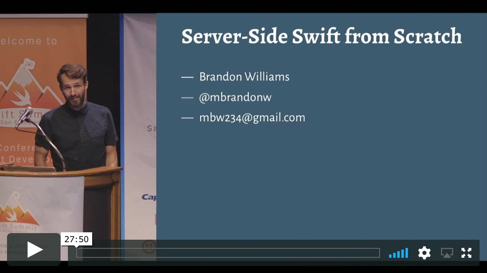

# 🎬 [www.pointfree.co](http://www.pointfree.co)

[](https://swift.org/download/)
[](https://circleci.com/gh/pointfreeco/pointfreeco)
[](https://travis-ci.org/pointfreeco/pointfreeco)
[](https://twitter.com/pointfreeco)

This repo contains the full source code for the [Point-Free](http://www.pointfree.co) website, a video series exploring Swift and functional programming. The codebase is split into 3 pieces:

* `PointFree`: This is the core application, and is responsible for routing requests, loading data and rendering HTML and CSS.
* `Styleguide`: This library contains functions and data types for creating a consistent style across the entire website.
* `Server`: This is the actual executable server. It uses [NIO](https://github.com/apple/swift-nio) to handle the low-level server responsibilities, and hands everything else over to the `PointFree` package.


## Getting Started

Interested in a [video tour of the code base](https://www.pointfree.co/episodes/ep22-a-tour-of-point-free)?

<a href="https://www.pointfree.co/episodes/ep22-a-tour-of-point-free">
  
</a>

The repo contains an extensive test suite and some playgrounds to explore. To get things running:

* Make sure [Xcode](https://developer.apple.com/xcode/) is installed!

* Make sure [`cmark`](https://github.com/commonmark/cmark) is installed. You can install it with Homebrew:
  ``` sh
  brew install cmark # or your preferred installation method
  ```

* Make sure [Postgres](https://www.postgresql.org) is installed _and running_. It's our database of choice. You can install it with Homebrew:
  ``` sh
  brew install postgres # or your preferred installation method
  brew services start postgresql # or your preferred launch method
  ```
  (If you use Postgres.app, EnterpriseDB, or another installation method, please follow some additional instructions in the [CPostgreSQL](https://github.com/vapor-community/cpostgresql) README.)

* Open up a terminal window and grab the code:
  ``` sh
  git clone https://github.com/pointfreeco/pointfreeco.git
  cd pointfreeco
  ```

* Bootstrap! If you want us to take care of the details for you, we need to install a few module maps in your SDK path to make sure CommonCrypto, Postgres, cmark, and other modules are available to our libraries, playgrounds, and tests. We also need to set up a `pointfreeco` user and database in Postgres. You can read our [Makefile](Makefile) for more info, and run:
  ``` sh
  make bootstrap-oss
  ```

With everything bootstrapped and the project open in Xcode, you can:

* Run the server locally
  * Select the `Server` target
  * Run: Command+R
  * Visit `http://localhost:8080`
* Explore our playgrounds
  * Select the `PointFree-Package` target
  * Build: Command+B
  * Open a [playground](https://github.com/pointfreeco/pointfreeco/tree/master/pointfreeco.playground)!

## Some fun things to explore

There're a lot of fun things to explore in this repo. For example:

  * We develop web pages in playgrounds for a continuous feedback loop. This is made possible by the fact that the entire server stack is composed of pure functions with side-effects pushed to the boundaries of the application. It allows us to load up any request in isolation, including `POST` requests, all without ever worrying about doing a side-effect.


  * We use [snapshot testing](https://github.com/pointfreeco/swift-snapshot-testing) to capture full data structures in order to verify their correctness. Not only do we do this in the traditional way of taking screenshots of web pages at various break points (e.g. on [iPhone](https://github.com/pointfreeco/pointfreeco/blob/fe09eae49835b603ee8083bdfdcee45b3fed81b0/Tests/PointFreeTests/__Snapshots__/LaunchSignupTests/testHome.3._375.0x667.0.png) and [desktop](https://github.com/pointfreeco/pointfreeco/blob/fe09eae49835b603ee8083bdfdcee45b3fed81b0/Tests/PointFreeTests/__Snapshots__/LaunchSignupTests/testHome.5._800.0x600.0.png)), but we can also snapshot any entire request-to-response lifecycle (e.g. the `POST` to a signup page does the correct [redirect](https://github.com/pointfreeco/pointfreeco/blob/fe09eae49835b603ee8083bdfdcee45b3fed81b0/Tests/PointFreeTests/__Snapshots__/LaunchSignupTests/testSignup.1.Conn.txt)).

```
▿ Step
  ResponseEnded

▿ Request
  POST http://localhost:8080/launch-signup

  email=hello@pointfree.co

▿ Response
  Status 302 FOUND
  Location: /?success=true
```

## Xcode Color Theme

Like the color theme we use in our episodes? Run `make colortheme` to install locally!

## Related projects

Point-Free uses a bunch of interesting open-source software:

  * 🗺 [swift-html](https://www.github.com/pointfreeco/swift-html): A Swift DSL for type-safe, extensible, and transformable HTML documents.
  * 🕸 [swift-web](https://www.github.com/pointfreeco/swift-web): A collection of types and functions for dealing with common web server concerns, such as HTML render, CSS preprocessing, middleware and more.
  * 🎶 [swift-prelude](https://www.github.com/pointfreeco/swift-prelude): Offers a standard library for experimental functional programming in Swift.
  * 🏷 [swift-tagged](https://www.github.com/pointfreeco/swift-tagged): Helps us create strong contracts with our data boundaries, like JSON from [GitHub](https://github.com/pointfreeco/pointfreeco/blob/d2dd9ff0f8caf0c8660eace050b7436c02e19aba/Sources/PointFree/GitHub.swift#L56) and [Stripe](https://github.com/pointfreeco/pointfreeco/blob/d2dd9ff0f8caf0c8660eace050b7436c02e19aba/Sources/PointFree/Stripe.swift#L92), and our [PostgreSQL data](https://github.com/pointfreeco/pointfreeco/blob/d2dd9ff0f8caf0c8660eace050b7436c02e19aba/Sources/PointFree/Database.swift#L95).
  * 📸 [swift-snapshot-testing](https://www.github.com/pointfreeco/swift-snapshot-testing): Powers our testing infrastructure by taking snapshots of various data structures to guarantee the correctness of their output. We use this on everything from [middleware](https://github.com/pointfreeco/pointfreeco/blob/27f6eae212c1fea48da24b1f16a26043baaea4aa/Tests/PointFreeTests/__Snapshots__/LaunchSignupTests/testSignup.1.Conn.txt) to ensure requests are correctly transformed into responses, and even entire web pages to make sure the site looks correct at a variety of sizes (e.g. on [iPhone](https://github.com/pointfreeco/pointfreeco/blob/fe09eae49835b603ee8083bdfdcee45b3fed81b0/Tests/PointFreeTests/__Snapshots__/LaunchSignupTests/testHome.3._375.0x667.0.png) and [desktop](https://github.com/pointfreeco/pointfreeco/blob/fe09eae49835b603ee8083bdfdcee45b3fed81b0/Tests/PointFreeTests/__Snapshots__/LaunchSignupTests/testHome.5._800.0x600.0.png)).

Explore more of our open-source on the [Point-Free](https://github.com/pointfreeco) organization.

## Learn More

Brandon gave a talk about most of the core ideas that went into this project at [Swift Summit 2017](http://www.swiftsummit.com).

<a href="https://www.skilled.io/u/swiftsummit/server-side-swift-from-scratch">
  
</a>


## Find this interesting?

Then check out [Point-Free](https://www.pointfree.co)!

## License

The content of this project itself is licensed under the [CC BY-NC-SA 4.0 license](https://creativecommons.org/licenses/by-nc-sa/4.0/), and the underlying source code used to format and display that content is licensed under the [MIT license](LICENSE).
