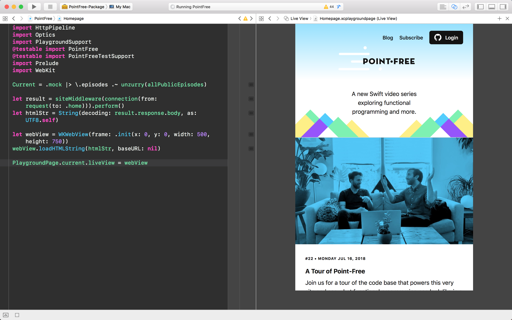

# [www.pointfree.co](http://www.pointfree.co)

macOS [](https://circleci.com/gh/pointfreeco/pointfreeco) Linux [](https://travis-ci.org/pointfreeco/pointfreeco)

This repo contains the application code for the [Point-Free](http://www.pointfree.co) website, a weekly video series exploring Swift and functional programming. It's responsible for routing requests, loading data and serving HTML. If you're interested in running it locally, check out the [server code](https://github.com/pointfreeco/pointfreeco-server), which is responsible for connecting a bare bones Kitura server to this code.


## Getting started

The repo contains an extensive test suite and some playgrounds to explore. To get things running:

  * Make sure [Xcode](https://developer.apple.com/xcode/) is installed!

  * Make sure [Postgres](https://www.postgresql.org) is installed and running. It's our database of choice. You can install it with Homebrew:
    ``` sh
    brew install postgres # or your preferred installation method
    ```

  * Open up a terminal window and grab the code:
    ``` sh
    git clone https://github.com/pointfreeco/pointfreeco.git
    cd pointfreeco
    ```

  * Bootstrap! If you want us to take care of the details for you, we need to install a few module maps in your SDK path to make CommonCrypto, WebKit's WKSnapshotConfiguration, and Postgres headers available to our libraries, playgrounds, and tests. We also need to set up a `pointfreeco` user and database in Postgres. You can read our [Makefile](Makefile) for more info, and run:
    ``` sh
    make
    ```

  * With everything bootstrapped and the project open in Xcode, you can:
      - Build: Command+B
      - Run tests: Command+U  
      - Open a playground!

## Some fun things to explore

There're a lot of fun things to explore in this repo. For example:

  * We develop web pages in playgrounds for a continuous feedback loop. This is made possible by the fact that the entire server stack is composed of pure functions with side-effects pushed to the boundaries of the application. It allows us to load up any request in isolation, including `POST` requests, all without ever worrying about doing a side-effect.


  * We use [snapshot testing](https://github.com/pointfreeco/swift-snapshot-testing) to capture full data structures in order to verify their correctness. Not only do we do this in the traditional way of taking screenshots of web pages at various break points (e.g. on [iPhone](https://github.com/pointfreeco/pointfreeco/blob/fe09eae49835b603ee8083bdfdcee45b3fed81b0/Tests/PointFreeTests/__Snapshots__/LaunchSignupTests/testHome.3._375.0x667.0.png) and [desktop](https://github.com/pointfreeco/pointfreeco/blob/fe09eae49835b603ee8083bdfdcee45b3fed81b0/Tests/PointFreeTests/__Snapshots__/LaunchSignupTests/testHome.5._800.0x600.0.png)), but we can also snapshot any entire request-to-response lifecycle (e.g. the `POST` to a signup page does the correct [redirect](https://github.com/pointfreeco/pointfreeco/blob/fe09eae49835b603ee8083bdfdcee45b3fed81b0/Tests/PointFreeTests/__Snapshots__/LaunchSignupTests/testSignup.1.Conn.txt)).

```
▿ Step
  ResponseEnded

▿ Request
  POST http://localhost:8080/launch-signup

  email=hello@pointfree.co

▿ Response
  Status 302 FOUND
  Location: /?success=true
```

## Related projects

Point-Free uses a bunch of interesting open-source software:

  * [swift-web](https://www.github.com/pointfreeco/swift-web): A collection of types and functions for dealing with common web server concerns, such as HTML render, CSS preprocessing, middleware and more.
  * [swift-prelude](https://www.github.com/pointfreeco/swift-prelude): Offers a standard library for experimental functional programming in Swift.
  * [swift-snapshot-testing](https://www.github.com/pointfreeco/swift-snapshot-testing): Powers our testing infrastructure by taking snapshots of various data structures to guarantee the correctness of their output. We use this on everything from [middleware](https://github.com/pointfreeco/pointfreeco/blob/27f6eae212c1fea48da24b1f16a26043baaea4aa/Tests/PointFreeTests/__Snapshots__/LaunchSignupTests/testSignup.1.Conn.txt) to ensure requests are correctly transformed into responses, and even entire web pages to make sure the site looks correct at a variety of sizes (e.g. on [iPhone](https://github.com/pointfreeco/pointfreeco/blob/fe09eae49835b603ee8083bdfdcee45b3fed81b0/Tests/PointFreeTests/__Snapshots__/LaunchSignupTests/testHome.3._375.0x667.0.png) and [desktop](https://github.com/pointfreeco/pointfreeco/blob/fe09eae49835b603ee8083bdfdcee45b3fed81b0/Tests/PointFreeTests/__Snapshots__/LaunchSignupTests/testHome.5._800.0x600.0.png)).

Explore more of our open-source on the [Point-Free](https://github.com/pointfreeco) organization.

## Find this interesting?

Then check out [Point-Free](https://www.pointfree.co), a soon-to-be-launching weekly video series exploring Swift and functional programming!

## License

The content of this project itself is licensed under the [CC BY-NC-SA 4.0 license](https://creativecommons.org/licenses/by-nc-sa/4.0/), and the underlying source code used to format and display that content is licensed under the [MIT license](LICENSE).
